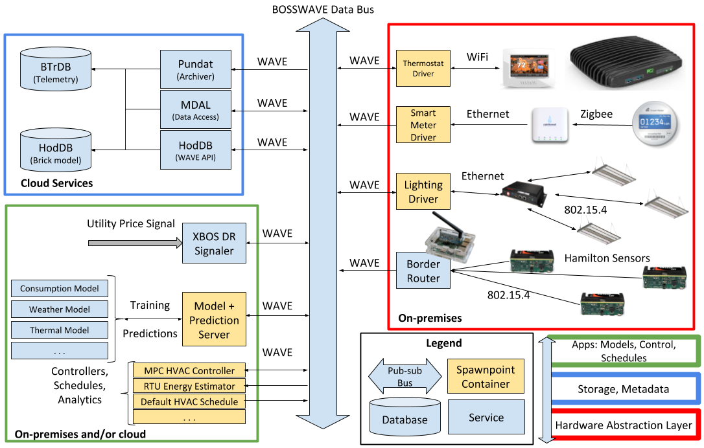
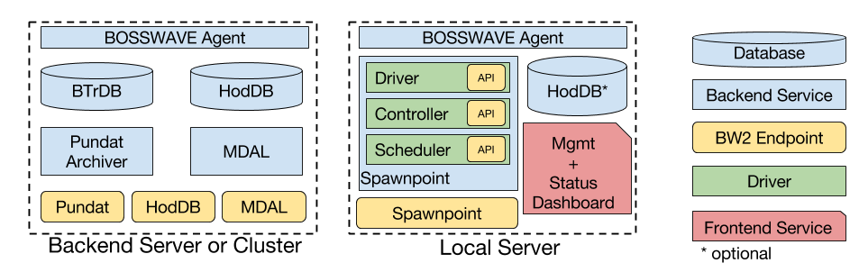

# XBOS Overview

## What is XBOS
XBOS (e**X**tensible **B**uilding **O**perating **S**ystem) is an open-source large-scale distributed operating system for smart buildings. XBOS provides **secure**:
- Real-time monitoring of building sensors
- Control of building actuators
- Collection, modeling, and analytics of building data
- Advanced management and coordination of building systems/subsystems

## XBOS Overarching Goal
XBOS aims to standardize a modular design that enables Software-Defined access to Internet-connected programmable sensors and controllers. This can be achieved by ... TODO!

## Why XBOS?
- XBOS provides fine-grained management of permissions for access to building resources, data, and controllers. These permissions are auditable, revocable, can be delegated, and are created and enforced without relying on any centralized authority. Delegated links can be replaced without re-granting the full chain of permissions. These features make XBOS suitable for handling the naturally complex administrative structures typical in building environments.
- All data-oriented processes in XBOS use metadata to bootstrap/configure themselves. This enables **portability** -- XBOS applications are largely agnostic to the underlying building infrastructure. This simplifies and reduces the development efforts spent in porting analytics, controllers, schedules, alarms, etc. from one building to another. Additionally, applications can use an XBOS building model to find out if a building has the required features/services for the application's operation.
- XBOS is **extensible** -- the architecture gracefully supports the introduction of new types of services.

## XBOS Features & Capabilities
- A common abstraction for IoT sensors and actuators, smart devices, building management systems, etc.
- Long-term secure storage of building telemetry
- Rich standardized metadata describing the building environment and its components
- Secure NAT-friendly communication (via a publish/subscribe bus)
- Decentralized authentication/authorization across multiple administrative domains
- Secure management of persistent processes
- Tools for developing and deploying portable analytics, schedules, controllers, and models
- Tools for developing and deploying user-facing applications

## XBOS Architecture
XBOS is assembled from a family of open-source technologies, which can be found via the [XBOS Github](https://github.com/SoftwareDefinedBuildings/XBOS). The overall architecture of XBOS and a brief description of these technologies are presented below.

XBOS is composed of a set of logically and physically distributed services, which are connected by a secure message bus. These services are broadly categorized into three layers:

1. **Hardware Abstraction Layer**: The hardware abstraction layer presents a common read/write [interface](https://docs.xbos.io/driver_interfaces.html) for a broad range of IoT devices (e.g., thermostats, light switches, humidity sensors, etc.), which is implemented by a set of [drivers](https://github.com/SoftwareDefinedBuildings/bw2-contrib/tree/master/driver). Drivers are persistent processes that hide the details of integration with smart devices, building management systems, web services, and other resources. Drivers can be extended to support any IoT sensor or actuator by exposing them as a set of standardized interfaces that can perform authenticated read/write operations. These drivers typically run on local computing resources (*edge* devices) and are managed by a secure orchestration manager [Spawnpoint](https://github.com/immesys/spawnpoint).
2. **Storage and Metadata Layer (Core Services)**: The storage and metadata layer provides the necessary mechanisms to store building telemetry (e.g., sensor data streams, external weather, etc.) and the metadata describing the (a) physical building information and (b) the relationship among data streams. This layer encompasses the core services provided by XBOS, which requires more computational capabilities than is usually available locally. While these services can be run on commodity hardware (i.e., a PC or laptop), they are usually run on a capable server or cluster (i.e., using a tool like Kubernetes) hosted in a datacenter or in the cloud. These services encompass:
	- **time-series data storage and retrieval**: [BTrDB](https://docs.xbos.io/btrdb.html) for data storage, [Pundat](https://docs.xbos.io/pundat.html) for data ingestion, and [MDAL](https://docs.xbos.io/mdal.html) for data retrieval.
	- **metadata storage and retrieval**: [Brick](https://brickschema.org/) for creating metadata models of buildings and [HodDB](https://hoddb.org/)(https://docs.xbos.io/hoddb.html) for storing/querying building metadata models.
3. **Application Layer (High-level Services)**: This layer includes high-level services that leverage the bottom two layers to implement monitoring, fault detection and diagnostics, analytics, schedules, controllers, models, and user interfaces. XBOS provides [Python bindings](https://docs.xbos.io/xbos_python.html), Go bindings (documentation forthcoming), and a [Lua DSL](https://github.com/gtfierro/bodge) to support the development of new applications and services. Sample high-level applications can be found in the [XBOS applications repository](https://github.com/SoftwareDefinedBuildings/XBOS/tree/master/apps).

**Syndication**: All of the above services communicate with each other using a secure publish/subscribe message bus named [BOSSWAVE](https://github.com/immesys/bw2). BOSSWAVE also provides and enforces authentication and authorization, for example, when reading/writing from/to a device interfaces or controlling access to building data.

## Typical Deployments
There is some flexibility in how these services can be placed on available computing resources, but the most common division is that of *cloud* and *edge/local*:

## Getting Started with XBOS
Security and authentication was not an afterthought but rather a core design requirement in XBOS. Therefore, you should always start by getting familiar with the XBOS Syndication mechanisms and the BOSSWAVE terminology. Once you are familiar with BOSSWAVE, there are many places where you can get started with XBOS depending on your goal/role. Below are some examples.

- I am a building manager and I want to deploy XBOS in my building/suite of buildings and store building data and metadata. Please look at the Hardware Abstraction Layer first then look at the Storage and Metadata Layer (Core Services).
- I am a data scientist and I want to build (applications, models, controllers, etc.) on top of XBOS. Please look at the Application Layer (High-level Services).
- I am a developer and I want to contribute to the XBOS software stack. Please look at the XBOS Main Components to see which one might be of interest to you.

## XBOS Main Components
This section presents more information and references to all of the XBOS technologies presented in the architecture section. Please refer to the Getting Started Section for which components might make sense to you as a starting point once you are familiar with BOSSWAVE.

### Syndication

#### BOSSWAVE

BOSSWAVE is a secure, distributed publish/subscribe message bus. Instead of messages being sent directly from data producers to data consumers, messages are sent to an intermediary called a **designated router** (sometimes called a broker). Publishers attach an identifying topic (called a URI) to each message sent to a broker. Subscribers tell the broker the topics they are interested in, and the broker forwards the relevant messages to the subscribers. We have chosen this architecture because the load of scaling is placed on capable servers acting as brokers, rather than on the data producers which are typically constrained and behind NATs (i.e., not publicly addressable).

All resources (e.g., drivers, services, etc.) are represented in BOSSWAVE as a collection of one or more URIs. A resource reports its status by publishing on its own URIs and receives commands by subscribing on its URIs. Resources implement control of other resources by publishing on the URIs of those resources.

BOSSWAVE enforces guarantees not offered by existing pub/sub systems, namely the ability to enforce fine-grained permissions on resources (logically represented by one or more topics) at global scale without relying on centralized or trusted infrastructure. Each service/resource in BOSSWAVE has an entity represented by a public/private Ed25519 key pair. This key pair is used for granting and revoking permissions on resources.

BOSSWAVE uses a fork of the Ethereum blockchain as decentralized storage for all identities and permissions.

There are several components of BOSSWAVE relevant to XBOS:
- **designated routers**: these are public servers that route data for one or more namespaces. A namespace is TODO!
- **agents**: these are local, persistent processes (usually one per server) that maintain a local copy of the blockchain and act as a local gateway for accessing the BOSSWAVE message bus

Source code:
- https://github.com/immesys/bw2
- https://github.com/immesys/bw2bind

Docs:
- TODO!

Publications:
- [Democratizing Authority in the Built Environment](http://bets.cs.berkeley.edu/publications/appliedwave.pdf)
- [WAVE: a Decentralized Authorization System for IOT via Blockchain Smart Contracts](https://www2.eecs.berkeley.edu/Pubs/TechRpts/2017/EECS-2017-234.html)

### Hardware Abstraction Layer

#### Drivers

TODO!

Source code:
- TODO!

Docs:
- TODO!

Publications:
- TODO!

#### Spawnpoint

Spawnpoint is a tool to deploy, run, and monitor services. It is primarily intended for services that communicate over BOSSWAVE, but it also has features for applications that wish to make use of native means of communication. A "Spawnpoint" is an individual machine that supports service execution by providing storage, a BOSSWAVE router for communication, and a pool of memory and compute resources. Individual services run in dedicated Docker containers that are instantiated and managed by a Spawnpoint.

Source code:
- https://github.com/immesys/spawnpoint

Docs:
- TODO!

Publications:
- TODO!

### Storage and Metadata Layer (Core Services)

#### BTrDB

BTrDB (Berkeley Tree Database) provides very fast storage and retrieval of scalar time-series data. It supports nanosecond timestamps, versioning of time-series streams, and boasts 16.7 million writes per second and 19.8 million reads per second on a single Intel Xeon E5-2680v2 based cloud server with 60GB of RAM (EC2 c3.8xlarge). Additionally, BTrDB accelerates computation of associative statistics over arbitrary time ranges, using precomputed statistics over power-of-two-aligned time ranges.

Source code:
- https://github.com/BTrDB/btrdb-server

Docs:
- https://docs.smartgrid.store/

Publications:
- [BTrDB: Optimizing Storage System Design for Timeseries Processing](https://www.usenix.org/system/files/conference/fast16/fast16-papers-andersen.pdf)

#### Pundat

Pundat (**Pun**ctuated **dat**a archiver) subscribes to data published on BOSSWAVE and saves it to BTrDB. Streams can be marked for archival using "archive requests" that describe to Pundat how to archive published data. Pundat can parse time-series data from arbitrary data structures.

Source code:
- https://github.com/gtfierro/PunDat

Docs:
- https://docs.xbos.io/pundat.html

Publications:
- TODO!

#### MDAL

MDAL retrieves, aggregates and formats time-series data from BTrDB using queries that reference a Brick model. Brick models contain UUIDs referring to specific streams of time-series data. MDAL data queries refer to time-series streams using metadata (via a query against a Brick model) rather than explicitly referring to the identifiers of those streams.

MDAL provides data cleaning, pre-caching and unit conversion capabilities while maintaining fast response times.

Source code:
- https://github.com/gtfierro/mdal

Docs:
- https://docs.xbos.io/mdal.html

Publications:
- TODO!

#### Brick

TODO!

Source code:
- https://github.com/BuildSysUniformMetadata/brick

Docs:
- TODO!

Publications:
- [Brick v1.0: Towards a Unified Metadata Schema for Buildings](https://people.eecs.berkeley.edu/~gtfierro/papers/brick.pdf)

#### HodDB

HodDB is a specialized RDF database and SPARQL query processor for Brick. It stores models of buildings and serves queries on those models. HodDB supports a limited subset of SPARQL, but can evaluate most queries in less than 100ms. It also provides HTTP and BOSSWAVE APIs, an HTTP UI for exploring Brick models and building queries.

Brick models, via HodDB, are the "single point of truth" for the configuration and operation for all data-oriented services in XBOS.

Source code:
- https://github.com/gtfierro/hod

Docs:
- https://hoddb.org/

Publications:
- [Design and Analysis of a Query Processor for Brick](https://people.eecs.berkeley.edu/~gtfierro/papers/hoddb.pdf)

### Application Layer (High-level Services)

#### Applications

XBOS makes it easy to develop data-oriented applications that leverage the hardware abstraction layer and core services. Some examples of applications written for XBOS are:

- **Building-wide HVAC scheduler**: this application queries a Brick model to discover all thermostats in a building and enacts the same schedule over all thermostats, independent of the make/model/API of the thermostat
- **Occupancy-driven HVAC + Lighting control**: this application trains an occupancy model for each HVAC zone (using Brick queries to discover the occupancy sensors for each zone), and executes a learned HVAC/Lighting schedule that adheres to the projected occupancy envelope for each zone
- **RTU energy estimator**: this application estimates the heating and cooling energy consumption for rooftop units (RTUs) by correlating thermostat state with full building demand. The application looks for transitions in thermostat state (e.g. from 'off' to 'cool'), identifies corresponding jumps/drops in building demand within a small window, and constructs a simple statistical model for each RTU
- **Site-agnostic energy consumption model**: this application uses a basic "similarity-based" model to predict energy usage over the current 24 hour period. This model can also leverage the RTU energy estimator (and a related model for lighting) to estimate only the "base" consumption of a building (without HVAC or lighting loads)
- **Site-agnostic thermal model**: this application trains a basic least-squares model to predict temperature in a room based on the current and historical temperatures of adjacent rooms and HVAC state. The training data for the model is automatically assembled using Brick queries.
- **Demand response controller**: this application listens for an OpenADR signal and then overrides thermostat and lighting controls to reduce consumption by widening deadbands and dimming lights. This can be augmented with thermal models to properly implement pre-cooling
- **Missing data detector**: this application periodically queries the data store for the past *N* minutes of data of each stream; if the stream is missing data, then the application uses Amazon's Simple Notification Service to email/text an administrator
- **Site Management Dashboard**: this application presents a simple management and scheduling interface for a site. Users can configure thermostat and lighting schedules, check current and forecasted energy consumption, and specify control policies for demand response events.
